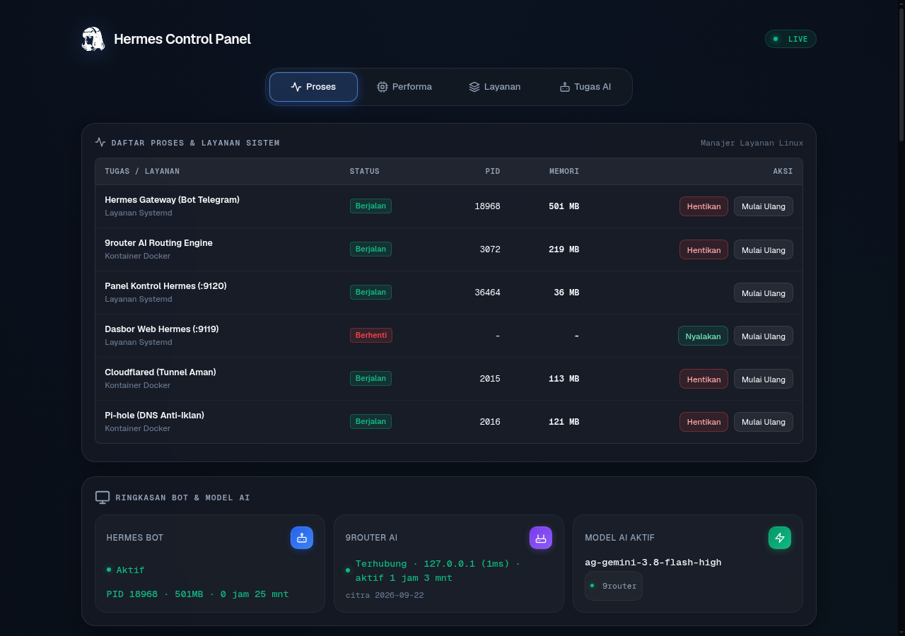
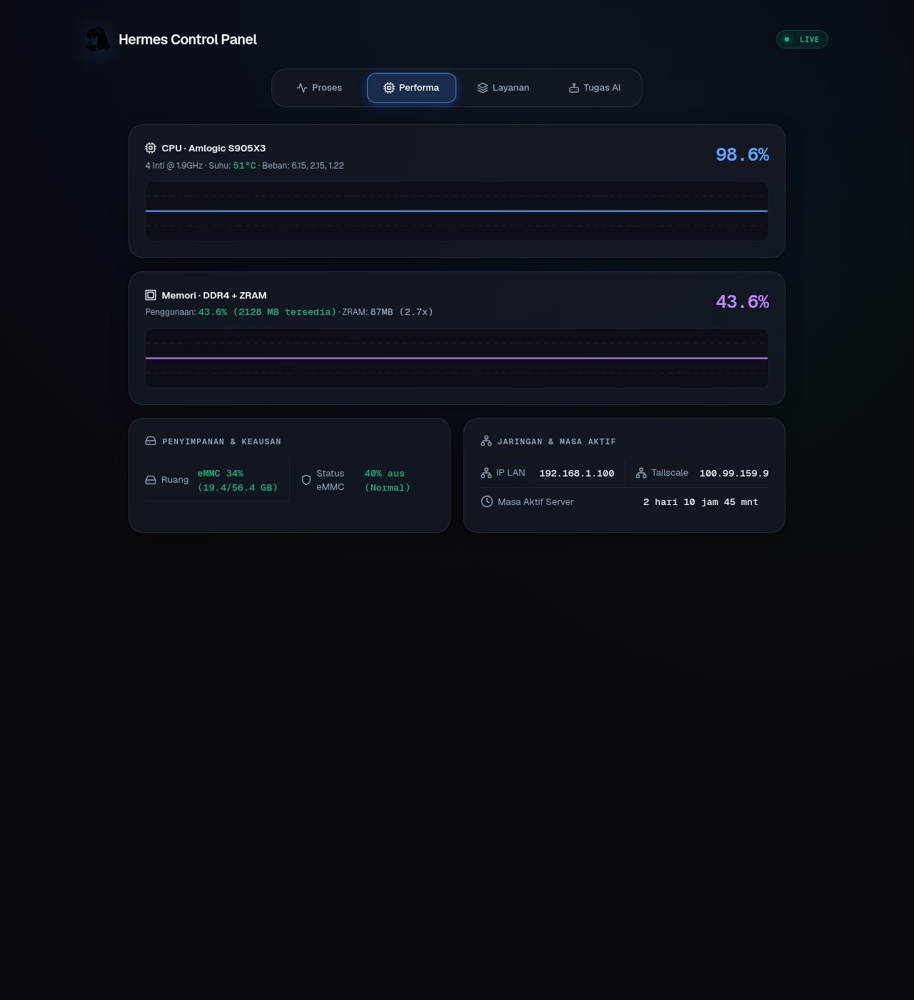
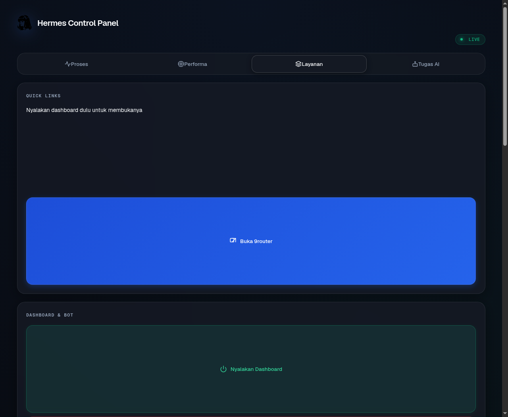
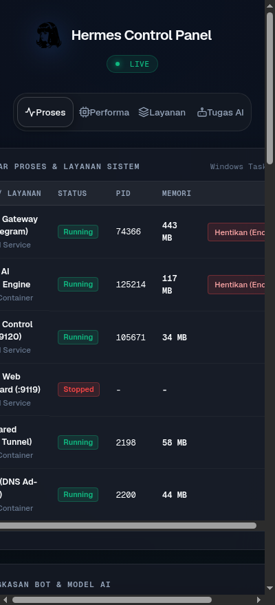

# Hermes Control Panel

[](https://www.python.org/)
[](https://github.com/chsprs/hermes-control-panel)
[](https://opensource.org/licenses/MIT)

Control panel web ultra-ringan (RAM <20MB, zero external frameworks, Python standard library murni + SSE push) untuk memonitor dan mengelola [Hermes Agent](https://github.com/NousResearch/hermes-agent) serta [9router](https://github.com/decolua/9router) pada server Linux SBC, STB Android Box (Armbian S905X/S905X3), Mini PC, maupun VPS.

---

## 📸 Tampilan Antarmuka

| Manajer Proses — Layanan Sistem | Real-time Performance Sparkline |
|:---:|:---:|
|  |  |

| Layanan, Fallback & Updater | Tampilan Mobile Responsif |
|:---:|:---:|
|  |  |

---

## 🚀 Fitur Utama

- ⚡ **Zero-Dependency & Hemat Resource**: Berjalan di atas Python standard library murni (`http.server`, `threading`, `json`, `urllib`). Tanpa runtime Node.js/frontend bundler, memori stabil di kisaran ~18–22MB RAM.
- 🔐 **Session Cookie Authentication**: Token tidak lagi menempel permanen di URL. Akses `?token=` sekali → server terbitkan cookie `HttpOnly` + `SameSite=Strict` dan redirect ke URL bersih `/status`. Seluruh mutasi dikunci ke HTTP POST (GET → `405 Method Not Allowed`), kecuali shortcut CasaOS (`/toggle`, `/on`, `/off`) dengan token valid. Tanpa `PANEL_TOKEN` server menolak start.
- 📡 **Manajemen & Konfigurasi Gateway Perpesanan**:
  - **Live Status & Badges**: Menampilkan daftar platform messaging terkonfigurasi di `config.yaml` (Telegram, Webhook, Discord, WhatsApp, Slack, dll.) dengan status live realtime: badge terhubung (`Terhubung`), belum konek (`Menghubungkan…` / `Terputus`), atau badge error (`Error`) beserta detail kode/pesan error.
  - **Kustomisasi Penuh UI (YAML Editor)**: Konfigurasi platform perpesanan langsung dari web UI layaknya mengedit langsung `config.yaml` (mendukung kunci kustom: token, port, allowed chats, channel overrides, hooks). Validasi sintaks YAML otomatis mencegah file rusak.
  - **Kontrol Cepat**: Tombol Nyalakan / Matikan (`enabled: true/false`), Tambah Platform Baru dengan template bawaan, serta Hapus Platform dengan pembaruan atomik dan opsi auto-restart gateway.
  - **Log Gateway Realtime**: Log aktivitas gateway Hermes (`gateway.log` & journalctl) ditampilkan langsung di Tab Layanan secara live via SSE dengan auto-scroll, tombol sembunyikan/tampilkan, dan proteksi sensor token otomatis (`[REDACTED]`). Dilengkapi endpoint `GET /api/gateway-log`.
- 📊 **Tampilan Manajer Proses**:
  - **Tab Proses**: Monitoring daftar proses sistem & container (`hermes-gateway`, `9router`, `cloudflared`, `hermes-dashboard`, dll.) dengan status, PID, memori, dan aksi End Task / Restart / Start langsung dari web.
  - **Tab Performa**: Grafik riwayat pemakaian CPU dan Memori (DDR4 + ZRAM) real-time menggunakan SVG sparkline tanpa dependensi chart JS eksternal.
  - **Tab Layanan**: Kontrol bot Telegram, toggle web dashboard resmi, pembersih sampah, quick links, dan pengaturan model backup.
  - **Tab Tugas AI**: Konfigurasi model khusus auxiliary tasks secara visual.
- 🔄 **Real-time SSE Push**: Metrik sistem (RAM, ZRAM, suhu SoC, health eMMC/HDD, status bot Telegram, IP LAN/Tailscale) terupdate live via *Server-Sent Events* dengan konsumsi CPU rendah.
- 🎛️ **Manajemen Model 9router**: Ganti default model Hermes instan dari browser. Model terkelompok rapi (9router Combos, OpenCode Zen Free, Nous Portal Free, Provider Lain) dilengkapi kolom pencarian interaktif.
- 🛡️ **Model Cadangan (Fallback)**: Susun prioritas model backup bertingkat yang otomatis dipanggil saat model utama terkena limit atau error (HTTP 429/500), tersimpan langsung ke `config.yaml`.
- 🧩 **Auxiliary Task Models**: Konfigurasi model AI terpisah untuk tugas-tugas spesifik (Vision, Context Compression, Skills Hub, MCP, Delegation, Approval, Title Generation, Triage, Curator).
- 📜 **Patch Notes Updater**: Menampilkan log pembaruan changelog terkini dari upstream GitHub secara otomatis di bawah tombol update.
- ⏱️ **TTL Probe Cache**: Probe berat (IP Tailscale, eMMC health, tabel proses, statistik disk) di-cache TTL singkat sehingga SSE tetap enteng di SoC Armbian.
- 📦 **Updater Terintegrasi & Aman**:
  - Update container 9router dengan proteksi OOM (otomatis menghentikan container sebelum `docker pull`).
  - Update native Hermes Agent resmi (`hermes update --yes`).
- 🧹 **Pembersih Sampah & Cache**: Truncate log update lama, bersihkan cache `uv`/`pip`, dan bersihkan cache layer docker dangling untuk melegakan penyimpanan eMMC.
- 💻 **Desain Responsif Desktop & Mobile**: Estetika modern Apple Control Center, optimal pada perangkat mobile, tablet, hingga layar desktop lebar (1080p/1440p).

---

## 📥 Instalasi Cepat (One-Liner)

Jalankan perintah berikut di terminal server Linux (sebagai root / sudo):

```bash
curl -fsSL https://raw.githubusercontent.com/chsprs/hermes-control-panel/main/install.sh | sudo bash
```

Installer otomatis:
1. Memasang dependensi sistem (`python3`, `python3-yaml`, `curl`, `git`, `lsof`).
2. Memasang **Hermes Agent** resmi jika belum terpasang di sistem.
3. Mengonfigurasi `loginctl enable-linger` agar service gateway aktif saat boot tanpa sesi SSH terbuka.
4. Menyalin skrip control panel dan mendaftarkan unit service `hermes-panel.service`.
5. Menjalankan service otomatis di port `9120`.

---

## 🛠️ Instalasi Manual

Jika ingin meng-clone repositori secara manual:

```bash
# 1. Clone repository
git clone https://github.com/chsprs/hermes-control-panel.git /opt/hermes-control-panel
cd /opt/hermes-control-panel

# 2. Berikan izin eksekusi
chmod +x install.sh uninstall.sh dashboard-toggle-server.py

# 3. Jalankan installer
sudo ./install.sh
```

---

## ⚙️ Konfigurasi Environment

Service dikelola melalui systemd pada berkas `/etc/systemd/system/hermes-panel.service`. Anda dapat menyesuaikan konfigurasi dengan menambahkan baris `Environment`:

| Variabel | Default | Keterangan |
|---|---|---|
| `PANEL_TOKEN` | *(auto-generate)* | Token autentikasi akses pertama (`?token=...`). **Wajib** — panel menolak start tanpa ini |
| `PANEL_PORT` | `9120` | Port listening HTTP web panel |
| `HERMES_CONFIG_PATH` | `/root/.hermes/config.yaml` | Lokasi berkas konfigurasi Hermes |
| `ROUTER_COMPOSE_DIR` | `/opt/AppData/9router` | Direktori docker-compose 9router |
| `ROUTER_DB_PATH` | `/DATA/AppData/9router/db/data.sqlite` | Lokasi database SQLite 9router |

Contoh kustomisasi:
```ini
[Service]
Environment=PANEL_TOKEN=rahasia123
Environment=PANEL_PORT=8080
```

Setelah mengubah konfigurasi unit systemd:
```bash
sudo systemctl daemon-reload
sudo systemctl restart hermes-panel.service
```

### 🔑 Cara Login Panel

1. Buka `http://<IP_SERVER>:9120/?token=<PANEL_TOKEN>` **satu kali** di browser.
2. Server menukar token dengan cookie sesi `hermes_panel_session` (HttpOnly, SameSite=Strict), lalu redirect ke URL bersih `/status` — token tidak tersimpan di address bar maupun riwayat browser.
3. Klik tombol aksi selanjutnya dikirim sebagai HTTP POST oleh JavaScript panel; request GET pada rute mutasi akan ditolak `405`.

> ℹ️ Token diambil dari output installer, atau cek kapan pun via:
> ```bash
> grep PANEL_TOKEN /etc/systemd/system/hermes-panel.service
> ```

---

## 🧪 Test Suite

Repositori menyertakan unit test tanpa dependensi eksternal:

```bash
python3 -m unittest -v tests/test_panel.py
```

Mencakup 16 skenario: updater error handling, propagasi gagal tulis config (HTTP 500), deduplikasi request model API, deteksi eMMC portable, hostname dinamis, auth cookie/session (403/302/200), penegakan 405/POST, dan TTL cache probe.

---

## 🔧 Manajemen Service

```bash
# Cek status panel
sudo systemctl status hermes-panel.service

# Restart panel
sudo systemctl restart hermes-panel.service

# Melihat log streaming
sudo journalctl -u hermes-panel.service -f

# Uninstall panel
sudo ./uninstall.sh
```

---

## 📄 Lisensi

Proyek ini dilisensikan di bawah lisensi [MIT](LICENSE).
